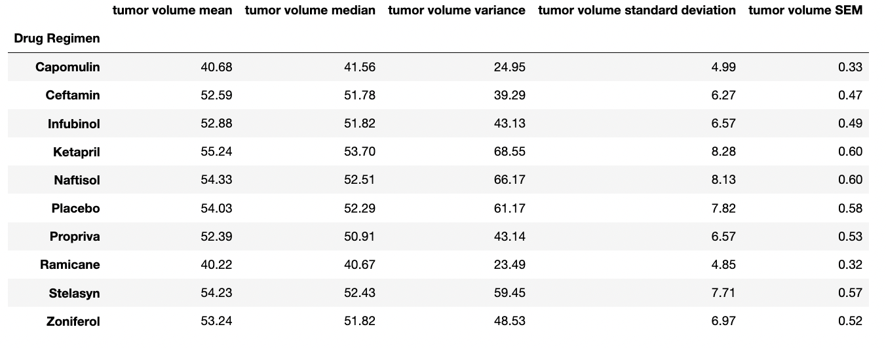

## Comparative Drug Performance on Treating Tumors in Mice

Analyzes Pharmaceutical Data Using Pandas and MatPlotLib

## Objectives:

In this study, 249 mice who were identified with SCC tumors received treatment with a range of drug regimens. Over the course of 45 days, tumor development was observed and measured. The purpose of this study was to compare the performance of Pymaceuticals’ drug of interest, Capomulin, against the other treatment regimens. This project generates all of the tables and figures needed for the technical report of the clinical study.

### Step 1 - Prepare the Data

* Merge the mouse_metadata and study_results DataFrames into a single DataFrame

* Display the number of unique mice IDs in the data, and then check for any mouse ID with duplicate time points
* Display the data associated with that mouse ID, and then create a new DataFrame where this data is removed
* Display the updated number of unique mice IDs

### Step 2 - Generate Summary Statistics

* Create a DataFrame of summary statistics including a row for each drug regimen and a column for each of the following statistics: mean, median, variance, standard deviation, and SEM of the tumor volume

### Step 3 - Create Bar Charts and Pie Charts

* Generate two bar charts that show the total number of time points for all mice tested for each drug regimen throughout the study
    * Create the first bar chart with the Pandas DataFrame.plot() method.
    
    
    
    * Create the second bar chart with Matplotlib's pyplot methods.    
    
    
    
* Generate two pie charts that show the distribution of female versus male mice in the study.
    * Create the first pie chart with the Pandas DataFrame.plot() method.
    
    
    
    * Create the second pie chart with Matplotlib's pyplot methods.    
    
    

### Step 4 - Calculate Quartiles, Find Outliers, and Create a Box Plot

* Create a grouped DataFrame that shows the last (greatest) time point for each mouse
    * Merge this grouped DataFrame with the original cleaned DataFrame
* Create a list that holds the treatment names as well as a second, empty list to hold the tumor volume data
* Loop through each drug in the treatment list, locating the rows in the merged DataFrame that correspond to each treatment
* Append the resulting final tumor volumes for each drug to the empty list
* Determine outliers by using the upper and lower bounds
Using Matplotlib, generate a box plot that shows the distribution of the final tumor volume for all the mice in each treatment group
    * Highlight any potential outliers in the plot by changing their color and style
    
    
    
### Step 5 - Create a Line Plot and a Scatter Plot

* Select a mouse that was treated with Capomulin, and generate a line plot of tumor volume versus time point for that mouse

* Generate a scatter plot of tumor volume versus mouse weight for the Capomulin treatment regimen

### Step 6 - Calculate Correlation and Regression

* Calculate the correlation coefficient and linear regression model between mouse weight and average tumor volume for the Capomulin treatment
* Plot the linear regression model on top of the previous scatter plot

    
---------------------------------------------------

<b>Contact:</b> bronwynmilne64@gmail.com

# Comparative Drug Performance on Treating Tumors in Mice

In the project, I utilized a set of pharmaceutical data to generate tables and figures regarding the comparative performace of all the drugs used in the study. First, I cleaned the data and generated summary statistics by using the 'groupby' and the 'agg' methods. 

Second, I created two bar plots using Panda's `DataFrame.plot()` method and MatPlotLib's 'pyplot' methods that show the total number of timepoints for all mice tested for each drug regimen throughout the course of the study.

Next, I created two pie charts using Panda's `DataFrame.plot()` method and MatPlotLib's 'pyplot' methods that show the distribution of female and male mice in the study.

Then, I calculatd the final tumor volume of each mouse across four of the treatment regimens, and calculated the quartiles and IQR to determine if there were any potential outliers. Using Matplotlib, I generated a box plot of the final tumor volume for all four treatment regimens and highlighted any potential outliers in the plot. 

Next, I created a line plot showing the relationship between tumor volume vs. time point for a mouse treated with Capomulin. I also generated a scatter plot of tumor volume versus mouse weight for the Capomulin treatment regimen.

Finally, I calculated the correlation coefficient and linear regression model between mouse weight and average tumor volume for the Capomulin treatment, and plotted the linear regression model on top of the previous scatter plot.

